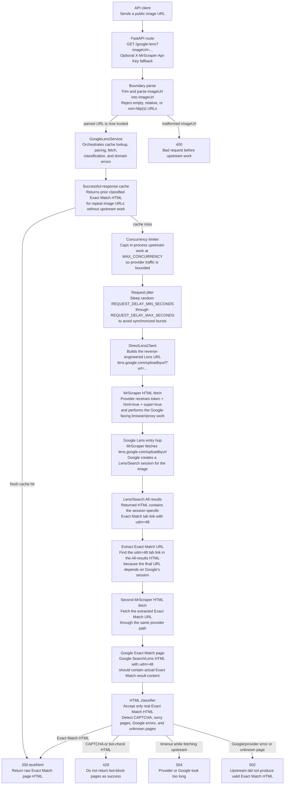

# API for Google Lens

FastAPI service for the Google Lens scraping coding challenge.

The target API accepts an image URL, performs a direct Google Lens / Google
Search Exact Match request, and returns the raw HTML for the Exact Match results
page.

## Table of Contents

- [Status](#status)
- [Endpoint](#endpoint)
- [Data Flow](#data-flow)
- [Project Structure](#project-structure)
- [Requirements](#requirements)
- [Setup](#setup)
- [Run](#run)
- [Test](#test)
- [Measure](#measure)
- [Optimization Experiments](#optimization-experiments)
- [Latency Diagnosis](#latency-diagnosis)
- [Provider Configuration](#provider-configuration)
- [Approach](#approach)

## Status

The repository is ready for code review and local evaluation. The Railway API
is deployed at `https://api-for-google-lens-production.up.railway.app`. Final
challenge scoring still needs a hosted one-hour or agreed remote test run
before claiming production scoring results.

At a glance:

| Challenge requirement | Current coverage |
| --- | --- |
| `GET /google-lens?imageUrl=...` | Implemented with typed query parsing. |
| Return raw Exact Match HTML | Implemented; non-Exact-Match pages are rejected. |
| Reverse-engineered/direct request bonus | Implemented through Google Lens/Search URLs fetched by MrScraper API-token mode. |
| Anti-bot strategy | MrScraper provider-side Google-facing rotation plus local browser headers, jitter, and concurrency limiting. |
| Meaningful errors | `400`, `429`, `502`, and `504` are mapped explicitly. |
| Local setup, run, and tests | Documented below; harness and unit suite pass locally. |
| Hosted API URL | Deployed on Railway at `https://api-for-google-lens-production.up.railway.app`. |
| 1-hour scoring proof | Not final yet; current evidence is local live measurement, not hosted final proof. |

The implementation has the FastAPI scaffold, typed request parsing, error
mapping, response classification, direct Google Lens request construction,
MrScraper HTML fetch wiring, local `.env` parsing, fixture coverage, and
dependency metadata.

The service intentionally uses MrScraper API-token HTML fetch mode for all live
Google Lens requests. The verified flow submits a minimal Lens `uploadbyurl`
request through MrScraper, receives the Google Search Lens page, follows the
Exact Match `udm=48` tab link through MrScraper, and returns the raw Exact Match
HTML. Plain local or datacenter HTTP clients have returned Google `403` pages
during live probes, and Google will rate-limit unrotated scraping traffic, so
direct non-provider Google traffic is not a supported runtime path.

## Endpoint

```text
GET /google-lens?imageUrl=<image_url>
```

Optional fallback header:

```text
X-MrScraper-Api-Key: <your_mrscraper_api_key>
```

Unauthenticated requests use the deployed server's MrScraper credits. If the
server runs out of credits, go to [MrScraper.com](https://mrscraper.com),
create a free account, and pass that account's API key in
`X-MrScraper-Api-Key` when making a request.

Success response:

```text
200 OK
Content-Type: text/html

<raw Google Lens Exact Match HTML>
```

Expected failure responses include:

- `400` for malformed `imageUrl` input.
- `402` when the unauthenticated server is out of MrScraper credits. Create a
  free account at [MrScraper.com](https://mrscraper.com) and retry with your
  API key in `X-MrScraper-Api-Key`.
- `429` for CAPTCHA, bot-check, or Google block pages.
- `502` for upstream request failures or unrecognized Google result pages.
- `504` for upstream timeouts.

## Data Flow

The API performs two MrScraper-backed Google fetches for a successful request.
The first fetch submits the image URL to Google Lens and lets Google create the
session-specific Search/Lens result page. That page is usually the All results
view, not the Exact Match view, but it contains the session-bound Exact Match
tab URL with `udm=48`. The second fetch requests that extracted `udm=48` URL
through MrScraper and returns the resulting Exact Match HTML after
classification. This two-step flow is necessary because the Exact Match URL is
not a stable transform of the image URL alone; it depends on Google-generated
Lens session parameters from the first response.



## Project Structure

- `app/main.py`: FastAPI application factory.
- `app/api.py`: `/google-lens` and `/healthz` route definitions.
- `app/models.py`: parsed boundary types such as `ImageUrl`.
- `app/errors.py`: domain errors and HTTP status mapping.
- `app/throttling.py`: in-process concurrency limiter.
- `app/lens/cache.py`: process-local cache for successful Exact Match HTML.
- `app/lens/direct.py`: direct Google request client.
- `app/lens/classifier.py`: upstream HTML classification.
- `app/lens/service.py`: fetch, classify, and error orchestration.
- `tests/`: unit tests for parsing, classification, and error mapping.

## Requirements

- Python 3.12+
- `uv` is recommended for dependency management
- Network access for dependency installation
- Network access for live Google Lens verification

Runtime dependencies are pinned in `pyproject.toml`.

## Setup

Recommended with `uv`:

```bash
uv venv
source .venv/bin/activate
uv pip install -e ".[dev]"
```

Fallback with Python and `pip`:

```bash
python3 -m venv .venv
source .venv/bin/activate
python3 -m pip install -e ".[dev]"
```

## Run

```bash
source .venv/bin/activate
uvicorn app.main:app --reload
```

With local environment variables:

```bash
cp .env.example .env
# Edit .env with local credentials. The app loads .env automatically, and
# process environment variables override matching .env values.
uvicorn app.main:app --reload
```

Health check:

```bash
curl "http://127.0.0.1:8000/healthz"
```

Hosted health check:

```bash
curl "https://api-for-google-lens-production.up.railway.app/healthz"
```

Example API call:

```bash
curl 'http://127.0.0.1:8000/google-lens?imageUrl=https://i.ebayimg.com/00/s/MTYwMFgxNjAw/z/BVcAAOSwS-9m4zOb/$_57.JPG'
```

Hosted API call:

```bash
curl 'https://api-for-google-lens-production.up.railway.app/google-lens?imageUrl=https://i.ebayimg.com/00/s/MTYwMFgxNjAw/z/BVcAAOSwS-9m4zOb/$_57.JPG'
```

If Google or the configured provider returns CAPTCHA, bot-check, or Google error
HTML, `/google-lens` returns a non-2xx response rather than passing that page
through as a successful Exact Match result.

## Test

Run the full local unit suite:

```bash
python3 -m unittest discover -s tests -p 'test_*.py'
```

Syntax-check the app and tests:

```bash
python3 -m compileall -q app tests
```

## Measure

Use `scripts/measure_lens_api.py` against a running local or hosted API to
produce latency, validity, and failure-rate evidence. Invalid `200` responses
that do not contain valid Exact Match HTML count against the error-rate
threshold because they would fail challenge scoring. The script writes
`report.json`, `verdict.json`, `samples.jsonl`, and `report.md` under
`.runtime/runs/lens-measure-...`.

Small smoke measurement:

```bash
python3 scripts/measure_lens_api.py \
  --base-url http://127.0.0.1:8000 \
  --image-url 'https://i.ebayimg.com/00/s/MTYwMFgxNjAw/z/BVcAAOSwS-9m4zOb/$_57.JPG' \
  --requests 5 \
  --concurrency 2 \
  --min-valid-exact 1 \
  --max-average-latency-seconds 60 \
  --max-error-rate 0.5
```

Hosted smoke measurement:

```bash
python3 scripts/measure_lens_api.py \
  --base-url https://api-for-google-lens-production.up.railway.app \
  --image-url 'https://i.ebayimg.com/00/s/MTYwMFgxNjAw/z/BVcAAOSwS-9m4zOb/$_57.JPG' \
  --requests 5 \
  --concurrency 2 \
  --min-valid-exact 1 \
  --max-average-latency-seconds 60 \
  --max-error-rate 0.5
```

Credit-conscious 5-minute estimate:

```bash
python3 scripts/measure_lens_api.py \
  --base-url https://api-for-google-lens-production.up.railway.app \
  --image-url-file .runtime/live-image-urls.txt \
  --requests 84 \
  --concurrency 16 \
  --rate-per-minute 16.7 \
  --randomize-image-urls \
  --image-url-seed 20260516 \
  --target five-minute-estimate
```

The 5-minute estimate is the preferred routine measurement because it uses
about one-twelfth of the credits of a full challenge run. It reports both the
planned `x12` projection and an observed-throughput hour estimate based on the
actual elapsed seconds, so slow provider responses or API queuing remain visible
in the artifact. The scaled checks require at least 25 valid Exact Match HTML
responses, average latency at or below 60 seconds, and error rate at or below
10%.

Full 1-hour challenge evidence run:

```bash
python3 scripts/measure_lens_api.py \
  --base-url https://api-for-google-lens-production.up.railway.app \
  --image-url-file .runtime/live-image-urls.txt \
  --requests 1000 \
  --concurrency 16 \
  --rate-per-minute 16.7 \
  --randomize-image-urls \
  --image-url-seed 20260516 \
  --target challenge
```

`--target challenge` checks the scoring targets currently tracked in the local
spec: at least 300 valid Exact Match HTML responses, average latency at or below
60 seconds, and error rate at or below 10%. Image URLs are recorded only as
short hashes in measurement artifacts. Use this full run as final evidence
before submission or when claiming a hosted max concurrency, not as the default
iteration loop.

## Optimization Experiments

The runtime keeps the direct reverse-engineered approach required by the
challenge: each request still goes through MrScraper API-token mode, reaches the
Google Lens Search page, follows the Exact Match `udm=48` tab, classifies the
HTML, and returns only actual Exact Match content.

Latency work is handled as controlled experiments rather than speculative
tuning. Each candidate change is tested against the same public API behavior:
valid Exact Match HTML must still be returned as `200`, CAPTCHA/bot/error pages
must still be rejected, the one-process concurrency model must remain explicit,
and any measured result must be recorded here whether it was kept or rejected.
Because MrScraper credits are limited, routine screening uses small 18-request
one-minute live samples at the challenge arrival pace before spending credits on
the 84-request five-minute estimate or a full 1,000-request challenge run.

Two measured latency optimizations, one reliability hardening change, and one
diagnostic hardening change are currently kept:

- `MAX_CONCURRENCY` defaults to `16` process-wide upstream slots. This is high
  enough to keep the API responsive at the evaluator's 16.7 requests/minute
  arrival pace without changing the scraping approach.
- Local request jitter defaults to `0.0s` through `0.25s`. This keeps a small
  anti-burst delay while avoiding the extra average wait from the earlier
  `0.25s` through `1.5s` range. In the small live sample below, this reduced
  average latency from the previous kept `28.62s` run to `22.22s`, about a 22%
  improvement. Because that sample used 18 requests, re-run the 84-request
  five-minute estimate before making a final hosted performance claim.
- Successful Exact Match responses are cached in process by normalized image
  URL for `RESPONSE_CACHE_TTL_SECONDS`, with duplicate in-flight cache misses
  coalesced into one upstream fetch. This is intended for repeated challenge
  image sets: the service still fetches and classifies the first successful
  response for each unique image URL, then serves later repeats from the
  verified HTML instead of spending additional provider requests.
- The app creates one process-scoped `httpx.AsyncClient` for MrScraper traffic
  and closes it during FastAPI shutdown. This avoids rebuilding the provider
  HTTP client for every upstream hop, keeps connection pooling available, and
  reduces per-request resource churn during soak tests. HTTPX documents client
  connection pooling as a way to reuse TCP connections and reduce latency,
  round-trips, and connection churn:
  <https://www.python-httpx.org/advanced/clients/>.
- Provider-hop timing is logged for each upstream Lens entry and Exact Match
  fetch. This does not reduce latency by itself, but it was added after the
  research pass because the dominant open question is whether latency comes
  from hop one, hop two, or local queueing. Logs include hop name, status,
  elapsed milliseconds, response byte count, and HTTP protocol version without
  logging API tokens or full image URLs.

Recent local live measurements with the same `.runtime/live-image-urls.txt`
input set:

| Run | Server setting | Requests | Valid Exact Match | Error rate | Avg latency | Max latency | Observed-throughput hour estimate | Outcome |
| --- | --- | ---: | ---: | ---: | ---: | ---: | ---: | --- |
| Baseline | `MAX_CONCURRENCY=4`, `REQUEST_DELAY_MIN_SECONDS=0.25`, `REQUEST_DELAY_MAX_SECONDS=1.5` | 84 | 84 | 0% | 26.19s | 34.25s | about 531 valid/hour | Superseded |
| Rejected pressure setting | `MAX_CONCURRENCY=8`, shared `httpx.AsyncClient` | 84 | 84 | 0% | 49.02s | 59.36s | 553 valid/hour | Rejected; latency too close to limit for little throughput gain |
| Kept concurrency setting | `MAX_CONCURRENCY=16`, shared `httpx.AsyncClient` | 48 | 48 | 0% | 28.62s | 40.49s | 834 valid/hour | Kept; best throughput evidence so far |
| Rejected provider resource blocking | `MAX_CONCURRENCY=4` from local `.env`, `MRSCRAPER_BLOCK_RESOURCES=true` | 18 | 18 | 0% | 49.26s | 76.13s | 472 valid/hour | Rejected; MrScraper's resource-blocking hint was slower for this Lens flow |
| Kept low-jitter setting | `MAX_CONCURRENCY=16`, `REQUEST_DELAY_MIN_SECONDS=0`, `REQUEST_DELAY_MAX_SECONDS=0.25`, `MRSCRAPER_BLOCK_RESOURCES=false` | 18 | 18 | 0% | 22.22s | 26.48s | 943 valid/hour | Kept; about 22% lower average latency than the prior kept 16-slot run |
| Rejected HTTPX pool tuning | `MAX_CONCURRENCY=16`, low jitter, `max_connections=16`, `max_keepalive_connections=16`, `keepalive_expiry=30s` | 18 | 18 | 0% | 25.66s | 32.29s | 657 valid/hour | Rejected; validity stayed perfect, but latency regressed versus the 22.22s low-jitter run |
| Rejected first-hop early cutoff | `MAX_CONCURRENCY=16`, low jitter, streamed Lens entry body until the `udm=48` Exact Match link appeared | 18 | 18 | 0% | 24.88s | 31.25s | 711 valid/hour | Rejected; correctness stayed perfect and cutoff fired, but latency still regressed versus the 22.22s low-jitter run |
| Rejected MrScraper geo code | `MAX_CONCURRENCY=16`, low jitter, `geoCode=US` on MrScraper fetches | 18 | 6 | 66.7% | 32.14s | 51.65s | 209 valid/hour | Rejected; validity collapsed with 3 bot blocks and 9 HTTP errors |

The `MAX_CONCURRENCY=8` pressure run stayed under the 60-second latency target,
but it did not materially improve observed throughput and pushed p95 latency
close to the limit. The `MAX_CONCURRENCY=16` run preserved a 0% measured error
rate, kept max latency around 40 seconds, and improved the observed-throughput
hour estimate by roughly 57% compared with the earlier 4-slot baseline.

The resource-blocking experiment came from MrScraper's CLI documentation, which
describes `--block-resources` as an HTML-mode option to block images, CSS, and
fonts for faster loading:
<https://docs.mrscraper.com/docs/getting-started/cli>. It was plausible because
this API returns HTML, not screenshots or page assets. It was rejected because
the measured Google Lens path got slower and had a higher tail latency. The
option remains available as `MRSCRAPER_BLOCK_RESOURCES=true` for future hosted
provider tests, but it is not the default.

The HTTPX pool-tuning experiment came from the same research pass. HTTPX
documents configurable connection limits and keepalive expiry:
<https://www.python-httpx.org/advanced/resource-limits/>. The tested setting
matched the 16-slot upstream limiter exactly and extended keepalive expiry to
30 seconds. It kept Exact Match validity perfect but increased average latency,
so the default pool behavior remains the earlier measured setting:
`max_connections=max(MAX_CONCURRENCY * 2, 20)` and
`max_keepalive_connections=max(MAX_CONCURRENCY, 10)`.

The first-hop early-cutoff experiment tested whether the API could stream the
Google Lens entry response and stop reading as soon as the Exact Match
`udm=48` tab URL appeared. This was plausible because saved Lens fixtures place
the `udm=48` marker around one-third of the HTML body. In the live run, cutoff
did fire, usually after reading roughly 350KB-630KB of the first response, but
the first hop had already taken about 16s-27s by then and average end-to-end
latency regressed to 24.88s. The implementation was therefore reverted. The
useful finding is diagnostic: the first MrScraper Lens-entry hop dominates
latency more than local response-body reading does.

The MrScraper `geoCode=US` experiment tested one of the few public provider
knobs that might affect first-hop routing or localization. It was rejected
immediately because it damaged the core challenge criteria: only 6 of 18
requests returned valid Exact Match HTML, 3 were classified as bot blocks, and
9 returned HTTP-style failures. The geo-code parameter is therefore not part of
the runtime contract.

These are local live measurements, not a substitute for the final hosted
one-hour run. Use the 84-request five-minute estimate before claiming a hosted
max-concurrency result, and reserve the full 1,000-request run for final
submission evidence.

## Latency Diagnosis

The dominant latency source is provider-side Google Lens fetching, not FastAPI
or local Python work. A successful API request commonly requires two upstream
MrScraper fetches:

1. Fetch `https://lens.google.com/uploadbyurl?url=...` through MrScraper.
2. Parse the returned Google Search / Lens HTML, extract the Exact Match
   `udm=48` tab URL, and fetch that URL through MrScraper.

That means one client request pays for two Google-facing anti-bot/rendering
operations. The provider is also responsible for residential or otherwise
rotated Google-facing behavior; plain local or datacenter HTTP requests have
returned Google `403` pages in live probes, so bypassing the provider is not a
valid optimization for this challenge.

Measured local contributors:

- Provider fetch time dominates the 20s-50s observed request latencies.
- Two-hop request shape doubles provider exposure for the common success path.
- Local jitter used to add about `0.25s` to `1.5s` before upstream work; lowering
  it to `0s` through `0.25s` removed avoidable local wait without increasing the
  measured error rate in the 18-request sample.
- A shared `httpx.AsyncClient` avoids per-hop connection setup to the MrScraper
  API. HTTPX resource limits are configured with enough keep-alive connections
  for the current `MAX_CONCURRENCY=16` default:
  <https://www.python-httpx.org/advanced/resource-limits/>.
- Provider-hop logs now show whether slow requests are spending time in the
  Lens entry hop or the Exact Match hop. This is the next useful diagnostic
  before spending another 84-request five-minute estimate.
- The first-hop early-cutoff experiment confirmed that the Exact Match hop is
  usually much faster than the Lens entry hop in the sampled run. Optimizing
  local HTML reading is not enough unless the provider can start returning the
  Exact Match link much earlier.
- The `geoCode=US` run suggests provider geo routing is risky for this Google
  Lens path: it increased blocks/failures enough to violate the challenge error
  target, so geo tuning is not a safe latency lever.
- Concurrency is a throughput and queueing lever, not a pure per-request
  latency lever. The 8-slot run was slower than both the 4-slot baseline and the
  16-slot run, which suggests provider-side scheduling variance matters and
  each setting must be measured.

## Provider Configuration

The API reads these environment variables:

- `GOOGLE_BASE_URL`: upstream Google Lens base URL. Defaults to
  `https://lens.google.com/uploadbyurl`.
- `REQUEST_TIMEOUT_SECONDS`: per-provider-hop upstream timeout. Defaults to
  `60.0`; hosted deployments should not use `30.0` because the Lens entry hop
  occasionally approaches or exceeds 30 seconds and the Exact Match hop can add
  another several seconds.
- `MAX_CONCURRENCY`: process-wide upstream concurrency limit for this API
  process. Defaults to `16`, based on the live optimization run above.
- `REQUEST_DELAY_MIN_SECONDS`: minimum randomized local delay before each
  provider request. Defaults to `0.0`.
- `REQUEST_DELAY_MAX_SECONDS`: maximum randomized local delay before each
  provider request. Defaults to `0.25`.
- `RESPONSE_CACHE_MAX_ENTRIES`: maximum number of successful Exact Match
  responses to keep in the process-local cache. Defaults to `512`; set to `0`
  to disable caching.
- `RESPONSE_CACHE_TTL_SECONDS`: maximum cache age for successful Exact Match
  responses. Defaults to `7200.0`; set to `0` to disable caching.
- `MRSCRAPER_BLOCK_RESOURCES`: optional MrScraper resource-blocking hint for
  images, CSS, and fonts. Defaults to `false` because the live Lens experiment
  was slower with it enabled.
- `USER_AGENT`: user agent sent upstream.
- `MRSCRAPER_API_KEY`: required MrScraper Scraper API token. The app asks
  MrScraper's HTML fetch endpoint to fetch each Google Lens / Search URL with
  `token`, `html=true`, `super=true`, and `url`.
- `MRSCRAPER_API_URL`: optional MrScraper Scraper API endpoint. Defaults to
  `https://api.mrscraper.com`.

Use [.env.example](.env.example) as the local template. The application loads a
repo-root `.env` file when present, then overlays process environment variables.
For deployment, prefer real process environment variables rather than copying
local `.env` files.

MrScraper Scraper API / Playground example:

```bash
export MRSCRAPER_API_KEY='atk_example'
```

Fallback using your own MrScraper API key:

```bash
curl \
  -H "X-MrScraper-Api-Key: atk_your_mrscraper_api_key" \
  'http://127.0.0.1:8000/google-lens?imageUrl=https://i.ebayimg.com/00/s/MTYwMFgxNjAw/z/BVcAAOSwS-9m4zOb/$_57.JPG'
```

MrScraper's HTML fetch API uses an API token query parameter plus render options
such as `html=true`, `super=true`, and `url=<target>`. That API-token flow is
the supported scraping provider for this project. The operational assumption is
that MrScraper supplies the Google-facing proxy rotation and anti-bot handling;
this app adds local concurrency limits and randomized request pacing so it does
not send avoidable bursts into the provider. The optional
`X-MrScraper-Api-Key` request header overrides the configured token for that
single API call, which lets evaluators retry with their own MrScraper account if
the unauthenticated server is out of credits. Do not commit API keys or saved
live HTML that includes account-specific request metadata.

### Anti-Bot And Bot-Evasion Posture

This implementation keeps bot evasion narrow and explicit. The app does not
ship a stealth browser, CAPTCHA solver, or local proxy pool. Instead, every live
Google request is sent through MrScraper's API-token HTML fetch mode, and the
app treats MrScraper as the Google-facing unblocker layer. In practice that
means the provider is expected to handle the externally visible browser
automation, IP/proxy rotation, TLS/browser fingerprinting, cookie/session
handling, and any browser rotation needed to make Google Lens pages load
reliably. The FastAPI service is responsible for building the direct
reverse-engineered Lens URLs, pacing requests into the provider, and rejecting
bad HTML.

The local anti-bot controls are:

- **Provider-only Google traffic:** the app does not send direct local or
  datacenter HTTP requests to Google in production. Earlier live probes returned
  Google `403` pages without the provider, so bypassing MrScraper is both less
  reliable and weaker for the challenge's "return real Exact Match HTML" goal.
- **Browser-like request headers:** every MrScraper fetch includes a stable
  desktop Chrome-style `USER_AGENT`, `accept`, `accept-language`,
  `sec-fetch-*`, and navigation headers. These headers describe the browser
  request that MrScraper should make on the app's behalf; they are not a full
  fingerprinting solution by themselves.
- **Process-wide concurrency cap:** `MAX_CONCURRENCY` limits how many upstream
  MrScraper fetch flows can run at once in one API process. The current measured
  default is `16`, which is intended to keep the service responsive at the
  evaluator's 16.7 requests/minute pace without creating an unbounded burst
  against the provider.
- **Randomized jitter before provider calls:** before a request enters the
  MrScraper fetch path, the service sleeps for a random duration between
  `REQUEST_DELAY_MIN_SECONDS` and `REQUEST_DELAY_MAX_SECONDS`. This is jitter:
  a small random delay that prevents every request from starting at perfectly
  regular or perfectly simultaneous intervals. The current measured defaults
  are `0.0` and `0.25`, meaning each request waits somewhere from no delay up to
  one quarter second before the provider fetch begins. A larger previous range
  of `0.25` to `1.5` seconds was safer-looking but added avoidable latency; the
  low-jitter range preserved 18/18 valid responses with 0% errors in the
  one-minute sample.
- **Successful-response cache:** when an image URL has already produced
  classified Exact Match HTML, the service can return that same raw HTML for
  later requests for the same image URL. This reduces provider pressure during
  repeated challenge corpora without returning unverified HTML: errors,
  CAPTCHA pages, Google error pages, ambiguous pages, and non-2xx upstream
  responses are never cached. Concurrent duplicate cache misses are also
  coalesced so one image URL creates at most one upstream fetch at a time in
  one process.
- **Response classification gate:** returned HTML is not trusted just because
  the upstream request succeeded. The service classifies the body and only
  returns `200` for pages recognized as real Exact Match results. CAPTCHA,
  Google sorry pages, bot-check pages, Google error pages, empty bodies, and
  ambiguous non-Exact-Match pages map to non-2xx API errors instead of being
  passed through as successful challenge responses.
- **No speculative provider knobs by default:** `MRSCRAPER_BLOCK_RESOURCES` is
  available but defaults to `false` because it was slower in live Lens tests.
  `geoCode=US` was also tested and rejected because it increased failures. The
  default configuration keeps only the provider options that have preserved
  Exact Match validity in measured runs.

The distinction matters for review: MrScraper owns rotation of the externally
visible browser/proxy identity; this repository owns deterministic request
construction, local pacing, concurrency control, successful-response caching,
error classification, and public evidence that the chosen settings work.

Note: `MAX_CONCURRENCY` is enforced per running API process. Multi-process
deployments need either one worker per instance or a shared limiter such as
Redis before claiming a cross-worker concurrency limit.

## Approach

The current implementation is structured around a direct Google Lens URL flow
fetched through MrScraper's API-token HTML endpoint. It submits the image URL to
Google Lens, follows the resulting Google Search / Lens page, classifies the
returned HTML, and only returns successful Exact Match pages to the caller.
