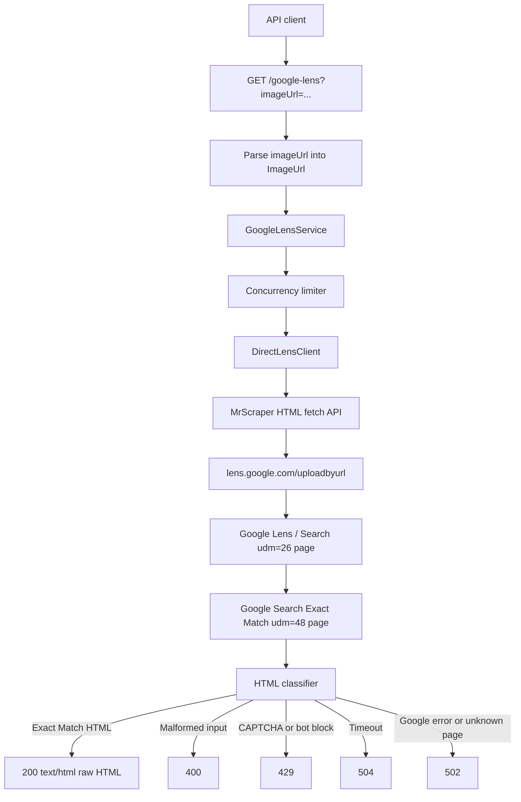

# API for Google Lens

FastAPI service for the Google Lens scraping coding challenge.

The target API accepts an image URL, performs a direct Google Lens / Google
Search Exact Match request, and returns the raw HTML for the Exact Match results
page.

## Table of Contents

- [Status](#status)
- [Endpoint](#endpoint)
- [Data Flow](#data-flow)
- [Project Structure](#project-structure)
- [Requirements](#requirements)
- [Setup](#setup)
- [Run](#run)
- [Test](#test)
- [Measure](#measure)
- [Optimization Evidence](#optimization-evidence)
- [Latency Diagnosis](#latency-diagnosis)
- [Provider Configuration](#provider-configuration)
- [Approach](#approach)

## Status

The repository is ready for code review and local evaluation. Final challenge
submission still needs a hosted API URL and a hosted one-hour or agreed remote
test run before claiming production scoring results.

At a glance:

| Challenge requirement | Current coverage |
| --- | --- |
| `GET /google-lens?imageUrl=...` | Implemented with typed query parsing. |
| Return raw Exact Match HTML | Implemented; non-Exact-Match pages are rejected. |
| Reverse-engineered/direct request bonus | Implemented through Google Lens/Search URLs fetched by MrScraper API-token mode. |
| Anti-bot strategy | MrScraper provider-side Google-facing rotation plus local browser headers, jitter, and concurrency limiting. |
| Meaningful errors | `400`, `429`, `502`, and `504` are mapped explicitly. |
| Local setup, run, and tests | Documented below; harness and unit suite pass locally. |
| 1-hour scoring proof | Not final yet; current evidence is local live measurement, not hosted final proof. |

The implementation has the FastAPI scaffold, typed request parsing, error
mapping, response classification, direct Google Lens request construction,
MrScraper HTML fetch wiring, local `.env` parsing, fixture coverage, and
dependency metadata.

The service intentionally uses MrScraper API-token HTML fetch mode for all live
Google Lens requests. The verified flow submits a minimal Lens `uploadbyurl`
request through MrScraper, receives the Google Search Lens page, follows the
Exact Match `udm=48` tab link through MrScraper, and returns the raw Exact Match
HTML. Plain local or datacenter HTTP clients have returned Google `403` pages
during live probes, and Google will rate-limit unrotated scraping traffic, so
direct non-provider Google traffic is not a supported runtime path.

## Endpoint

```text
GET /google-lens?imageUrl=<image_url>
```

Success response:

```text
200 OK
Content-Type: text/html

<raw Google Lens Exact Match HTML>
```

Expected failure responses include:

- `400` for malformed `imageUrl` input.
- `429` for CAPTCHA, bot-check, or Google block pages.
- `502` for upstream request failures or unrecognized Google result pages.
- `504` for upstream timeouts.

## Data Flow



## Project Structure

- `app/main.py`: FastAPI application factory.
- `app/api.py`: `/google-lens` and `/healthz` route definitions.
- `app/models.py`: parsed boundary types such as `ImageUrl`.
- `app/errors.py`: domain errors and HTTP status mapping.
- `app/throttling.py`: in-process concurrency limiter.
- `app/lens/direct.py`: direct Google request client.
- `app/lens/classifier.py`: upstream HTML classification.
- `app/lens/service.py`: fetch, classify, and error orchestration.
- `tests/`: unit tests for parsing, classification, and error mapping.

## Requirements

- Python 3.12+
- `uv` is recommended for dependency management
- Network access for dependency installation
- Network access for live Google Lens verification

Runtime dependencies are pinned in `pyproject.toml`.

## Setup

Recommended with `uv`:

```bash
uv venv
source .venv/bin/activate
uv pip install -e ".[dev]"
```

Fallback with Python and `pip`:

```bash
python3 -m venv .venv
source .venv/bin/activate
python3 -m pip install -e ".[dev]"
```

## Run

```bash
source .venv/bin/activate
uvicorn app.main:app --reload
```

With local environment variables:

```bash
cp .env.example .env
# Edit .env with local credentials. The app loads .env automatically, and
# process environment variables override matching .env values.
uvicorn app.main:app --reload
```

Health check:

```bash
curl "http://127.0.0.1:8000/healthz"
```

Example API call:

```bash
curl 'http://127.0.0.1:8000/google-lens?imageUrl=https://i.ebayimg.com/00/s/MTYwMFgxNjAw/z/BVcAAOSwS-9m4zOb/$_57.JPG'
```

If Google or the configured provider returns CAPTCHA, bot-check, or Google error
HTML, `/google-lens` returns a non-2xx response rather than passing that page
through as a successful Exact Match result.

## Test

Run the full local unit suite:

```bash
python3 -m unittest discover -s tests -p 'test_*.py'
```

Syntax-check the app and tests:

```bash
python3 -m compileall -q app tests
```

## Measure

Use `scripts/measure_lens_api.py` against a running local or hosted API to
produce latency, validity, and error-rate evidence. The script writes
`report.json`, `verdict.json`, `samples.jsonl`, and `report.md` under
`.runtime/runs/lens-measure-...`.

Small smoke measurement:

```bash
python3 scripts/measure_lens_api.py \
  --base-url http://127.0.0.1:8000 \
  --image-url 'https://i.ebayimg.com/00/s/MTYwMFgxNjAw/z/BVcAAOSwS-9m4zOb/$_57.JPG' \
  --requests 5 \
  --concurrency 2 \
  --min-valid-exact 1 \
  --max-average-latency-seconds 60 \
  --max-error-rate 0.5
```

Credit-conscious 5-minute estimate:

```bash
python3 scripts/measure_lens_api.py \
  --base-url https://your-host.example \
  --image-url-file .runtime/live-image-urls.txt \
  --requests 84 \
  --concurrency 16 \
  --rate-per-minute 16.7 \
  --target five-minute-estimate
```

The 5-minute estimate is the preferred routine measurement because it uses
about one-twelfth of the credits of a full challenge run. It reports both the
planned `x12` projection and an observed-throughput hour estimate based on the
actual elapsed seconds, so slow provider responses or API queuing remain visible
in the artifact. The scaled checks require at least 25 valid Exact Match HTML
responses, average latency at or below 60 seconds, and error rate at or below
10%.

Full 1-hour challenge evidence run:

```bash
python3 scripts/measure_lens_api.py \
  --base-url https://your-host.example \
  --image-url-file .runtime/live-image-urls.txt \
  --requests 1000 \
  --concurrency 16 \
  --rate-per-minute 16.7 \
  --target challenge
```

`--target challenge` checks the scoring targets currently tracked in the local
spec: at least 300 valid Exact Match HTML responses, average latency at or below
60 seconds, and error rate at or below 10%. Image URLs are recorded only as
short hashes in measurement artifacts. Use this full run as final evidence
before submission or when claiming a hosted max concurrency, not as the default
iteration loop.

## Optimization Evidence

The runtime keeps the direct reverse-engineered approach required by the
challenge: each request still goes through MrScraper API-token mode, reaches the
Google Lens Search page, follows the Exact Match `udm=48` tab, classifies the
HTML, and returns only actual Exact Match content.

Two measured optimizations are currently kept:

- `MAX_CONCURRENCY` defaults to `16` process-wide upstream slots. This is high
  enough to keep the API responsive at the evaluator's 16.7 requests/minute
  arrival pace without changing the scraping approach.
- Local request jitter defaults to `0.0s` through `0.25s`. This keeps a small
  anti-burst delay while avoiding the extra average wait from the earlier
  `0.25s` through `1.5s` range. In the small live sample below, this reduced
  average latency from the previous kept `28.62s` run to `22.22s`, about a 22%
  improvement. Because that sample used 18 requests, re-run the 84-request
  five-minute estimate before making a final hosted performance claim.
- The app creates one process-scoped `httpx.AsyncClient` for MrScraper traffic
  and closes it during FastAPI shutdown. This avoids rebuilding the provider
  HTTP client for every upstream hop, keeps connection pooling available, and
  reduces per-request resource churn during soak tests. HTTPX documents client
  connection pooling as a way to reuse TCP connections and reduce latency,
  round-trips, and connection churn:
  <https://www.python-httpx.org/advanced/clients/>.

Recent local live measurements with the same `.runtime/live-image-urls.txt`
input set:

| Run | Server setting | Requests | Valid Exact Match | Error rate | Avg latency | Max latency | Observed-throughput hour estimate | Outcome |
| --- | --- | ---: | ---: | ---: | ---: | ---: | ---: | --- |
| Baseline | `MAX_CONCURRENCY=4`, `REQUEST_DELAY_MIN_SECONDS=0.25`, `REQUEST_DELAY_MAX_SECONDS=1.5` | 84 | 84 | 0% | 26.19s | 34.25s | about 531 valid/hour | Superseded |
| Rejected pressure setting | `MAX_CONCURRENCY=8`, shared `httpx.AsyncClient` | 84 | 84 | 0% | 49.02s | 59.36s | 553 valid/hour | Rejected; latency too close to limit for little throughput gain |
| Kept concurrency setting | `MAX_CONCURRENCY=16`, shared `httpx.AsyncClient` | 48 | 48 | 0% | 28.62s | 40.49s | 834 valid/hour | Kept; best throughput evidence so far |
| Rejected provider resource blocking | `MAX_CONCURRENCY=4` from local `.env`, `MRSCRAPER_BLOCK_RESOURCES=true` | 18 | 18 | 0% | 49.26s | 76.13s | 472 valid/hour | Rejected; MrScraper's resource-blocking hint was slower for this Lens flow |
| Kept low-jitter setting | `MAX_CONCURRENCY=16`, `REQUEST_DELAY_MIN_SECONDS=0`, `REQUEST_DELAY_MAX_SECONDS=0.25`, `MRSCRAPER_BLOCK_RESOURCES=false` | 18 | 18 | 0% | 22.22s | 26.48s | 943 valid/hour | Kept; about 22% lower average latency than the prior kept 16-slot run |

The `MAX_CONCURRENCY=8` pressure run stayed under the 60-second latency target,
but it did not materially improve observed throughput and pushed p95 latency
close to the limit. The `MAX_CONCURRENCY=16` run preserved a 0% measured error
rate, kept max latency around 40 seconds, and improved the observed-throughput
hour estimate by roughly 57% compared with the earlier 4-slot baseline.

The resource-blocking experiment came from MrScraper's CLI documentation, which
describes `--block-resources` as an HTML-mode option to block images, CSS, and
fonts for faster loading:
<https://docs.mrscraper.com/docs/getting-started/cli>. It was plausible because
this API returns HTML, not screenshots or page assets. It was rejected because
the measured Google Lens path got slower and had a higher tail latency. The
option remains available as `MRSCRAPER_BLOCK_RESOURCES=true` for future hosted
provider tests, but it is not the default.

These are local live measurements, not a substitute for the final hosted
one-hour run. Use the 84-request five-minute estimate before claiming a hosted
max-concurrency result, and reserve the full 1,000-request run for final
submission evidence.

## Latency Diagnosis

The dominant latency source is provider-side Google Lens fetching, not FastAPI
or local Python work. A successful API request commonly requires two upstream
MrScraper fetches:

1. Fetch `https://lens.google.com/uploadbyurl?url=...` through MrScraper.
2. Parse the returned Google Search / Lens HTML, extract the Exact Match
   `udm=48` tab URL, and fetch that URL through MrScraper.

That means one client request pays for two Google-facing anti-bot/rendering
operations. The provider is also responsible for residential or otherwise
rotated Google-facing behavior; plain local or datacenter HTTP requests have
returned Google `403` pages in live probes, so bypassing the provider is not a
valid optimization for this challenge.

Measured local contributors:

- Provider fetch time dominates the 20s-50s observed request latencies.
- Two-hop request shape doubles provider exposure for the common success path.
- Local jitter used to add about `0.25s` to `1.5s` before upstream work; lowering
  it to `0s` through `0.25s` removed avoidable local wait without increasing the
  measured error rate in the 18-request sample.
- A shared `httpx.AsyncClient` avoids per-hop connection setup to the MrScraper
  API. HTTPX resource limits are configured with enough keep-alive connections
  for the current `MAX_CONCURRENCY=16` default:
  <https://www.python-httpx.org/advanced/resource-limits/>.
- Concurrency is a throughput and queueing lever, not a pure per-request
  latency lever. The 8-slot run was slower than both the 4-slot baseline and the
  16-slot run, which suggests provider-side scheduling variance matters and
  each setting must be measured.

## Provider Configuration

The API reads these environment variables:

- `GOOGLE_BASE_URL`: upstream Google Lens base URL. Defaults to
  `https://lens.google.com/uploadbyurl`.
- `REQUEST_TIMEOUT_SECONDS`: upstream timeout. Defaults to `30.0`.
- `MAX_CONCURRENCY`: process-wide upstream concurrency limit for this API
  process. Defaults to `16`, based on the live optimization run above.
- `REQUEST_DELAY_MIN_SECONDS`: minimum randomized local delay before each
  provider request. Defaults to `0.0`.
- `REQUEST_DELAY_MAX_SECONDS`: maximum randomized local delay before each
  provider request. Defaults to `0.25`.
- `MRSCRAPER_BLOCK_RESOURCES`: optional MrScraper resource-blocking hint for
  images, CSS, and fonts. Defaults to `false` because the live Lens experiment
  was slower with it enabled.
- `USER_AGENT`: user agent sent upstream.
- `MRSCRAPER_API_KEY`: required MrScraper Scraper API token. The app asks
  MrScraper's HTML fetch endpoint to fetch each Google Lens / Search URL with
  `token`, `html=true`, `super=true`, and `url`.
- `MRSCRAPER_API_URL`: optional MrScraper Scraper API endpoint. Defaults to
  `https://api.mrscraper.com`.

Use [.env.example](.env.example) as the local template. The application loads a
repo-root `.env` file when present, then overlays process environment variables.
For deployment, prefer real process environment variables rather than copying
local `.env` files.

MrScraper Scraper API / Playground example:

```bash
export MRSCRAPER_API_KEY='atk_example'
```

MrScraper's HTML fetch API uses an API token query parameter plus render options
such as `html=true`, `super=true`, and `url=<target>`. That API-token flow is
the supported scraping provider for this project. The operational assumption is
that MrScraper supplies the Google-facing proxy rotation and anti-bot handling;
this app adds local concurrency limits and randomized request pacing so it does
not send avoidable bursts into the provider. Do not commit API keys or saved
live HTML that includes account-specific request metadata.

Note: `MAX_CONCURRENCY` is enforced per running API process. Multi-process
deployments need either one worker per instance or a shared limiter such as
Redis before claiming a cross-worker concurrency limit.

## Approach

The current implementation is structured around a direct Google Lens URL flow
fetched through MrScraper's API-token HTML endpoint. It submits the image URL to
Google Lens, follows the resulting Google Search / Lens page, classifies the
returned HTML, and only returns successful Exact Match pages to the caller.
