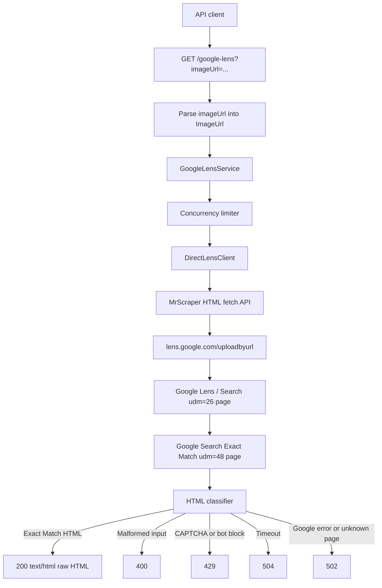

# API for Google Lens

FastAPI service for the Google Lens scraping coding challenge.

The target API accepts an image URL, performs a direct Google Lens / Google
Search Exact Match request, and returns the raw HTML for the Exact Match results
page.

## Table of Contents

- [Status](#status)
- [Endpoint](#endpoint)
- [Data Flow](#data-flow)
- [Project Structure](#project-structure)
- [Requirements](#requirements)
- [Setup](#setup)
- [Run](#run)
- [Test](#test)
- [Measure](#measure)
- [Provider Configuration](#provider-configuration)
- [Approach](#approach)

## Status

The project currently has the FastAPI scaffold, typed request parsing, error
mapping, response classification, direct Google Lens request construction,
MrScraper HTML fetch wiring, local `.env` parsing, fixture coverage, and
dependency metadata.

The service intentionally uses MrScraper API-token HTML fetch mode for all live
Google Lens requests. The verified flow submits a minimal Lens `uploadbyurl`
request through MrScraper, receives the Google Search Lens page, follows the
Exact Match `udm=48` tab link through MrScraper, and returns the raw Exact Match
HTML. Plain local or datacenter HTTP clients have returned Google `403` pages
during live probes, and Google will rate-limit unrotated scraping traffic, so
direct non-provider Google traffic is not a supported runtime path.

## Endpoint

```text
GET /google-lens?imageUrl=<image_url>
```

Success response:

```text
200 OK
Content-Type: text/html

<raw Google Lens Exact Match HTML>
```

Expected failure responses include:

- `400` for malformed `imageUrl` input.
- `429` for CAPTCHA, bot-check, or Google block pages.
- `502` for upstream request failures or unrecognized Google result pages.
- `504` for upstream timeouts.

## Data Flow



## Project Structure

- `app/main.py`: FastAPI application factory.
- `app/api.py`: `/google-lens` and `/healthz` route definitions.
- `app/models.py`: parsed boundary types such as `ImageUrl`.
- `app/errors.py`: domain errors and HTTP status mapping.
- `app/throttling.py`: in-process concurrency limiter.
- `app/lens/direct.py`: direct Google request client.
- `app/lens/classifier.py`: upstream HTML classification.
- `app/lens/service.py`: fetch, classify, and error orchestration.
- `tests/`: unit tests for parsing, classification, and error mapping.

## Requirements

- Python 3.12+
- `uv` is recommended for dependency management
- Network access for dependency installation
- Network access for live Google Lens verification

Runtime dependencies are pinned in `pyproject.toml`.

## Setup

Recommended with `uv`:

```bash
uv venv
source .venv/bin/activate
uv pip install -e ".[dev]"
```

Fallback with Python and `pip`:

```bash
python3 -m venv .venv
source .venv/bin/activate
python3 -m pip install -e ".[dev]"
```

## Run

```bash
source .venv/bin/activate
uvicorn app.main:app --reload
```

With local environment variables:

```bash
cp .env.example .env
# Edit .env with local credentials. The app loads .env automatically, and
# process environment variables override matching .env values.
uvicorn app.main:app --reload
```

Health check:

```bash
curl "http://127.0.0.1:8000/healthz"
```

Example API call:

```bash
curl 'http://127.0.0.1:8000/google-lens?imageUrl=https://i.ebayimg.com/00/s/MTYwMFgxNjAw/z/BVcAAOSwS-9m4zOb/$_57.JPG'
```

If Google or the configured provider returns CAPTCHA, bot-check, or Google error
HTML, `/google-lens` returns a non-2xx response rather than passing that page
through as a successful Exact Match result.

## Test

Run the full local unit suite:

```bash
python3 -m unittest discover -s tests -p 'test_*.py'
```

Syntax-check the app and tests:

```bash
python3 -m compileall -q app tests
```

## Measure

Use `scripts/measure_lens_api.py` against a running local or hosted API to
produce latency, validity, and error-rate evidence. The script writes
`report.json`, `verdict.json`, `samples.jsonl`, and `report.md` under
`.runtime/runs/lens-measure-...`.

Small smoke measurement:

```bash
python3 scripts/measure_lens_api.py \
  --base-url http://127.0.0.1:8000 \
  --image-url 'https://i.ebayimg.com/00/s/MTYwMFgxNjAw/z/BVcAAOSwS-9m4zOb/$_57.JPG' \
  --requests 5 \
  --concurrency 2 \
  --min-valid-exact 1 \
  --max-average-latency-seconds 60 \
  --max-error-rate 0.5
```

Credit-conscious 5-minute estimate:

```bash
python3 scripts/measure_lens_api.py \
  --base-url https://your-host.example \
  --image-url-file .runtime/live-image-urls.txt \
  --requests 84 \
  --concurrency 4 \
  --rate-per-minute 16.7 \
  --target five-minute-estimate
```

The 5-minute estimate is the preferred routine measurement because it uses
about one-twelfth of the credits of a full challenge run. It projects the
observed counts by `12` to estimate a 1-hour result and checks the scaled
thresholds: at least 25 valid Exact Match HTML responses in 5 minutes, average
latency at or below 60 seconds, and error rate at or below 10%.

Full 1-hour challenge evidence run:

```bash
python3 scripts/measure_lens_api.py \
  --base-url https://your-host.example \
  --image-url-file .runtime/live-image-urls.txt \
  --requests 1000 \
  --concurrency 4 \
  --rate-per-minute 16.7 \
  --target challenge
```

`--target challenge` checks the scoring targets currently tracked in the local
spec: at least 300 valid Exact Match HTML responses, average latency at or below
60 seconds, and error rate at or below 10%. Image URLs are recorded only as
short hashes in measurement artifacts. Use this full run as final evidence
before submission or when claiming a hosted max concurrency, not as the default
iteration loop.

## Provider Configuration

The API reads these environment variables:

- `GOOGLE_BASE_URL`: upstream Google Lens base URL. Defaults to
  `https://lens.google.com/uploadbyurl`.
- `REQUEST_TIMEOUT_SECONDS`: upstream timeout. Defaults to `30.0`.
- `MAX_CONCURRENCY`: process-wide upstream concurrency limit for this API
  process. Defaults to `4`.
- `REQUEST_DELAY_MIN_SECONDS`: minimum randomized local delay before each
  provider request. Defaults to `0.25`.
- `REQUEST_DELAY_MAX_SECONDS`: maximum randomized local delay before each
  provider request. Defaults to `1.5`.
- `USER_AGENT`: user agent sent upstream.
- `MRSCRAPER_API_KEY`: required MrScraper Scraper API token. The app asks
  MrScraper's HTML fetch endpoint to fetch each Google Lens / Search URL with
  `token`, `html=true`, `super=true`, and `url`.
- `MRSCRAPER_API_URL`: optional MrScraper Scraper API endpoint. Defaults to
  `https://api.mrscraper.com`.

Use [.env.example](.env.example) as the local template. The application loads a
repo-root `.env` file when present, then overlays process environment variables.
For deployment, prefer real process environment variables rather than copying
local `.env` files.

MrScraper Scraper API / Playground example:

```bash
export MRSCRAPER_API_KEY='atk_example'
```

MrScraper's HTML fetch API uses an API token query parameter plus render options
such as `html=true`, `super=true`, and `url=<target>`. That API-token flow is
the supported scraping provider for this project. The operational assumption is
that MrScraper supplies the Google-facing proxy rotation and anti-bot handling;
this app adds local concurrency limits and randomized request pacing so it does
not send avoidable bursts into the provider. Do not commit API keys or saved
live HTML that includes account-specific request metadata.

Note: `MAX_CONCURRENCY` is enforced per running API process. Multi-process
deployments need either one worker per instance or a shared limiter such as
Redis before claiming a cross-worker concurrency limit.

## Approach

The current implementation is structured around a direct Google Lens URL flow
fetched through MrScraper's API-token HTML endpoint. It submits the image URL to
Google Lens, follows the resulting Google Search / Lens page, classifies the
returned HTML, and only returns successful Exact Match pages to the caller.
